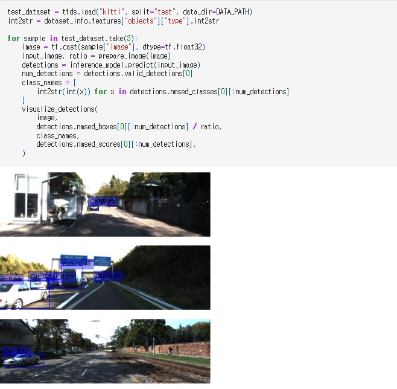

🔑 **PRT(Peer Review Template)**
- CODER : 변인섭
- REVIEWER : 이현동

- [x]  **1. 주어진 문제를 해결하는 완성된 코드가 제출되었나요? (완성도)**
    > - 문제에서 요구하는 최종 결과물이 첨부되었는지 확인
    > - 문제를 해결하는 완성된 코드란 프로젝트 루브릭 3개 중 2개, 퀘스트 문제 요구조건 등을 지칭
    > - 해당 조건을 만족하는 부분의 코드 및 결과물을 캡쳐하여 사진으로 첨부

    - [x] KITTI 데이터셋 구조와 내용을 파악하고 이를 토대로 필요한 데이터셋 가공을 정상 진행  
        - 데이터 전처리 method  
            
        - 전처리 pipeline  
            

    - [x] 바운딩박스가 정확히 표시된 시각화된 이미지를 생성  
        

    - [ ] 테스트 수행결과 90% 이상의 정확도

- [x]  **2. 프로젝트에서 핵심적인 부분에 대한 설명이 주석(닥스트링) 및 마크다운 형태로 잘 기록되어있나요? (설명)**
    - [x]  모델 선정 이유  
         

    - [x]  Loss 선정 이유  
        

- [ ]  **3. 체크리스트에 해당하는 항목들을 모두 수행하였나요? (문제 해결)**
    > - [ ]  데이터를 분할하여 프로젝트를 진행했나요? (train, validation, test 데이터로 구분)
    > - [ ]  하이퍼파라미터를 변경해가며 여러 시도를 했나요? (learning rate, dropout rate, unit, batch size, epoch 등)
    > - [ ]  각 실험을 시각화하여 비교하였나요?
    > - [ ]  모든 실험 결과가 기록되었나요?
    
    - 테스트 수행결과 method를 아직 수행하지 못함.  

    - Test Image에 대한 시각화 및 추론 결과 print method를 구현함.  
        

- [x]  **4. 프로젝트에 대한 회고가 상세히 기록 되어 있나요? (회고, 정리)**  
      
    - [x]  배운 점
    - [x]  아쉬운 점
    - [x]  느낀 점
    - [x]  어려웠던 점
