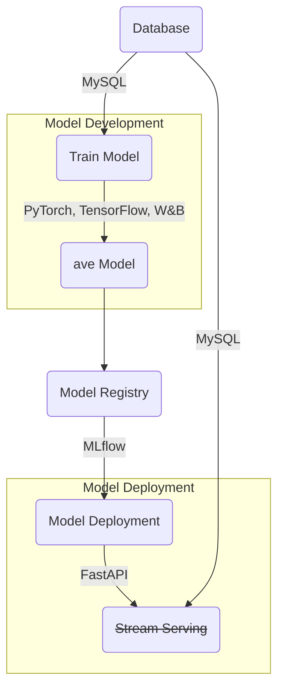

```mermaid
graph TB
    A(Database) -->|MySQL| B(Train Model)
    B -->|PyTorch, TensorFlow, W&B| C(ave Model)
    C --> D(Model Registry)
    D -->|MLflow| E(Model Deployment)
    E --> |FastAPI| F(Stream Serving)
    A -->|MySQL| F(Stream Serving)

    subgraph "Model Development"
        B
        C
    end

    subgraph "Model Deployment"
        E
        F
    end

    style F text-decoration:line-through
```